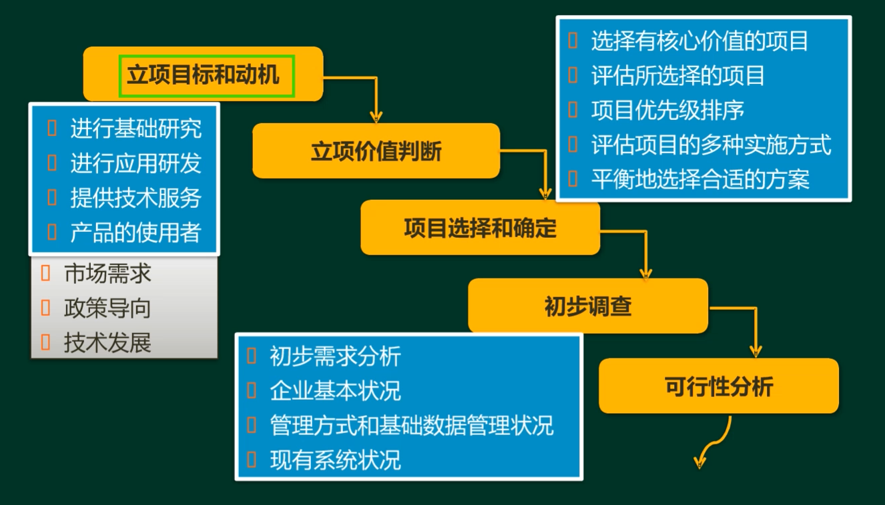

# 系统分析师
## 2.系统规划（案例分析）
- 系统规划的步骤：  

- 项目的机会选择：项目的motivation  

- 可行性分析 - 概述  
经济可行性：成本收益分析，能否创造价值  
技术可行性：技术风险分析，能否实现  
法律可行性（社会可行性）  
用户使用可行性：

- 可行性分析 - 评价矩阵  

- 成本效益分析 - 基本概率  

> 冬季给员工发采暖费 -> 间接成本  

- 成本效益分析 - 盈亏临界分析  
销售额=固定成本+可变成本+利润  
销售额=固定成本+可变成本 （盈亏平衡）  
盈亏平衡点销售量=$\frac{总固定成本}{销售单价-单位变动成本}$  
盈亏平衡点销售额=$\frac{总固定成本}{1-总变动成本/{销售收入}}$d